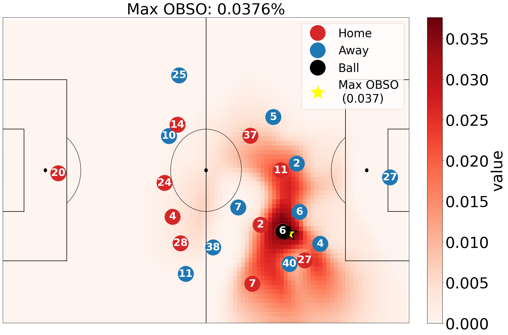
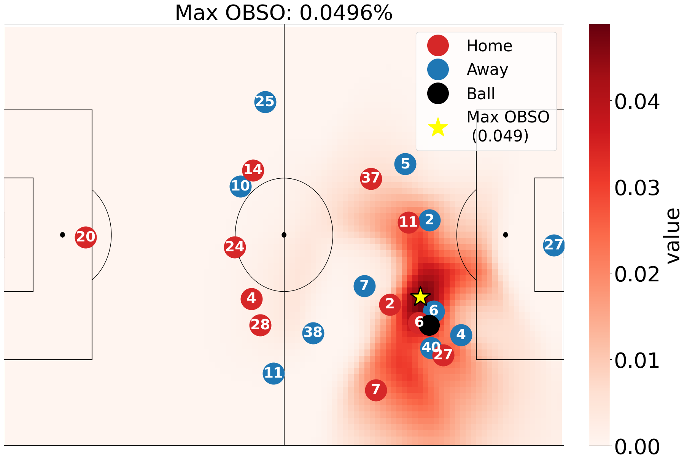

# Valuing La Pausa
This is the repository for valuing optimal pass timing for football players using OBSO (Off-Ball Scoring Opportunity).

---

## La Pausa Example
The optimal pass is executed slightly later than the actual timing, allowing off-ball spaces to fully develop. The animation shows the full play context, while the snapshots compare the actual and delayed pass moments.

<p align="center">
    
</p>

<table align="center">
  <tr>
    <th>
      <p align="center"><font size="4">Actual Timing</b></font></p>
    </th>
    <th>
      <p align="center"><font size="4">Optimal Timing (Slower)</b></font></p>
    </th>
  </tr>
  <tr>
    <td align="center">
      
    </td>
    <td align="center">
      
    </td>
  </tr>
</table>

---

## Installation and Setup
- This Paper was developed with Python 3.11.10.
```
git clone https://github.com/leemingo/mitssac-pausa.git
cd value-pausa
pip install -r requirements.txt
```

## Project Structure

```
🗂️ mitssac-pausa/
├── 🗂️ data
│   ├── 🗂️ dfl # DFL DataSet
        ├── 🗂️ raw
            ├── 🗂️ DFL-MAT-J03WMX # Match ID
            │   ├── 📄 DFL_02_01_matchinformation_DFL-COM-000001_DFL-MAT-J03WMX.xml       # Match metadata
            │   ├── 📄 DFL_03_02_events_raw_DFL-COM-000001_DFL-MAT-J03WMX.xml             # Event data
            │   ├── 📄 DFL_04_03_positions_raw_observed_DFL-COM-000001_DFL-MAT-J03WMX.xml # Tracking data
            ├── 🗂️ Other Match ID ... 
        ├── 🗂️ elastic
            ├── 🗂️ DFL-MAT-J03WMX # Match ID
            │   ├── 📄 meta_data.parquet             
            │   ├── 📄 event.parquet
            │   ├── 📄 tracking.parquet
            │   ├── 📄 raw_tracking.parquet
            ├── 🗂️ Other Match ID ... 
        ├── 🗂️ obso     
            ├── 🗂️ DFL-MAT-J03WMX # Match ID
                ├── 🗂️ event
                    │   ├── 📄 obso.pkl   
                    │   ├── 📄 ... 
                ├── 🗂️ trace 
                    │   ├── 📄 obso.pkl   
                    │   ├── 📄 ... 
                ├── 🗂️ virtual  # compute PAUSA
                    │   ├── 📄 pass_events.pkl 
                    │   ├── 📄 virtual_obso_maps.pkl  # Transition, scoring, pitch control maps
                    │   ├── 📄 virtual_obso.pkl 
                    │   ├── 📄 ... 
            ├── 🗂️ Other Match ID ... 
│   └── 🗂️ static # Static data (e.g., Transition.csv, EPV_grid.csv, xT_grid.json)
├── 🗂️ elastic                # Synchronization of tracking and event data
│   ├── 🗂️ sync               # Synchronization Logic
│   ├── 🗂️ tools              # Unified Spadl format
│   ├── 📄 convert_elastic.py # Main synchronization script
│   └── ...
├── 🗂️ notebooks               
│   ├──  1-visualize-obso.ipynb # OBSO visualization
│   ├── 2-calculate-pausa.ipynb # PAUSA computation and visualization
│   ├──  3-analysis-pausa.ipynb # Player- and team-level PAUSA analysis
├── calculate_obso.py # Main OBSO computation
├── loader.py         # Customized dataloader for PAUSA
├── obso.py           # OBSO computation logic
├── pitch_control.py  # Pitch control model
├── xthreat.py        # Expected Threat (xT) computation
└── ...
```

## Data Usage
- Unfortunately, we cannot share the full DFL dataset. However, we provide seven publicly available matches, which are sufficient to reproduce the main experiments in this repository.
- Public dataset: [DFL DataSet](https://springernature.figshare.com/articles/dataset/-An_integrated_dataset_of_spatiotemporal_and_event_data_in_elite_soccer/28196177).
- Download the public DFL matches from the link above. Organize each match using its match ID as the directory name.

## Running the Code

### 1. Elastic Data Preprocessing
- [The Elastic Framework](https://github.com/hyunsungkim-ds/elastic) operates on data converted into a SPADL format.
```bash
python elastic/convert_elastic.py --data_dir ~/geonhee/Data/dfl/raw --save_dir ./data/dfl/elastic --n_jobs -1
```

### 2. Caculate OBSO

```bash
# Event-level OBSO
python calculate_obso.py --provider dfl --unit event --game_id DFL-MAT-J03WMX --data_dir ./data/dfl/elastic --output_dir ./data/dfl/obso --n_jobs -1

# Tracking-level OBSO
python calculate_obso.py --provider dfl --unit trace --game_id DFL-MAT-J03WMX --data_dir ./data/dfl/elastic --output_dir ./data/dfl/obso --n_jobs -1

# Virtual trajectory-based OBSO
# This mode generates counterfactual trajectories to estimate OBSO under all possible timing scenarios.
python calculate_obso.py --provider dfl --unit virtual --game_id DFL-MAT-J03WMX --data_dir ./data/dfl/elastic --output_dir ./data/dfl/obso --n_jobs -1
```

### 3. Run Analysis [Notebook 3](https://github.com/leemingo/mitssac-pausa/blob/main/notebooks/3-analysis-pausa.ipynb)
- Compute PAUSA, xT, POP, and related metrics.
- Perform quantitative analysis (e.g., correlations between metrics).
- Perform qualitative analysis, including player- and team-level rankings

## License
This project is developed for research purposes.

## Research
please consider citing the following papers:
- Minho Lee, Geonhee Jo, Miru Hong, Pascal Bauer, and Sang-Ki Ko. **Valuing La Pausa: Quantifying Optimal Pass Timing Beyond Speed.** In 2026 MIT Sloan Sports Analytics Conference. <br/>[ [paper](https://www.sloansportsconference.com/conference/2026-conference) | [github](https://github.com/leemingo/mitssac-pausa.git) ]

## Affiliations
This research is conducted by **[Korea AI Research Society for Sports (KAISports)](https://sites.google.com/view/kaisport)**.  
