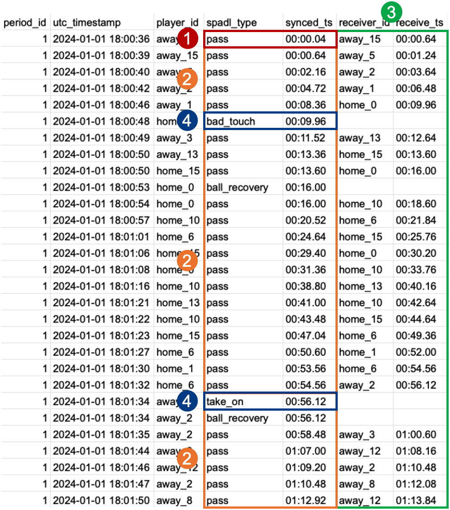
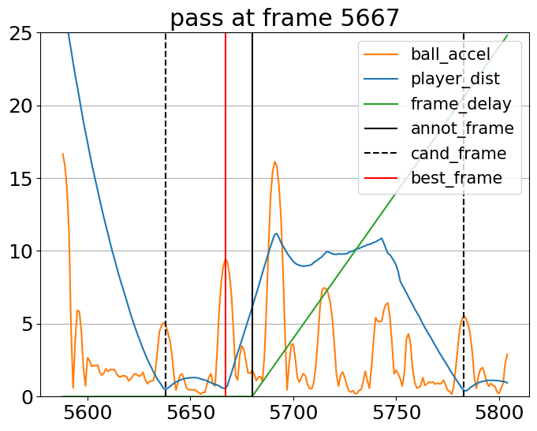
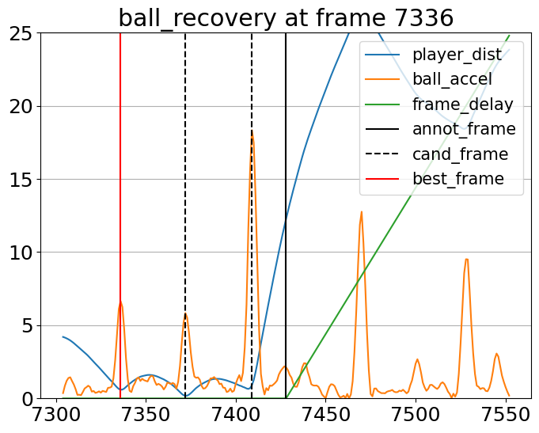
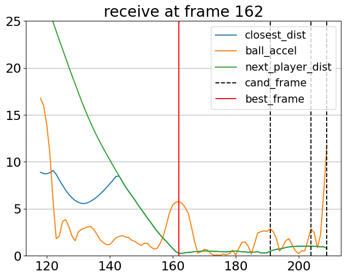
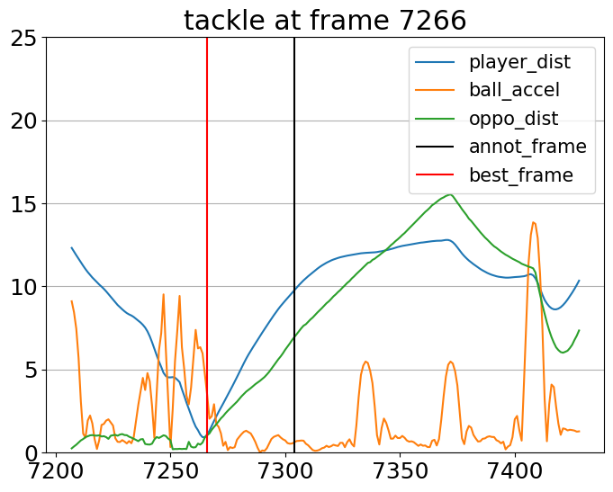

<h1 align="center">ELASTIC</h1>

<p align="center">
  
  <a href="https://opensource.org/licenses/MPL-2.0">
    
  </a>
</p>

Source code for the paper [ELASTIC: Event-Tracking Data Synchronization in Soccer Without Annotated Event Locations](https://dtai.cs.kuleuven.be/events/MLSA25/papers/MLSA25_paper_181.pdf) by Kim et al., MLSA 2025.

## Introduction
**ELASTIC (Event-Location-AgnoSTIC synchronizer)** is an algorithm for synchronizing event and tracking data in soccer. The source code is largely based on its previous work, [ETSY (Van Roy et al., 2023)](https://github.com/ML-KULeuven/ETSY.git), but the key difference is that our algorithm does not rely on human-annotated event locations, which are also prone to spatial errors.

Instead, ELASTIC leverages more subtle motion features such as ball acceleration and kick distance to precisely detect the moment of pass-like or incoming events, as well as the player-ball distance that ETSY used. Our experimental results demonstrate that it outperforms existing synchronizers by a large margin.

As a visual result, [this video](https://github.com/user-attachments/assets/525d4c1c-2f73-4247-b1b5-16f36cd1e6af) compares the raw event timestamps/locations (black "x") and the synchronized event timestamps/locations (orange "★"), alongside player and ball trajectories.
<p align="center">
  
</p>

## Getting Started
First, install ELASTIC and necessary packages with the following commands.
```
git clone https://github.com/hyunsungkim-ds/elastic.git
cd elastic
pip install -r requirements.txt
```
Then, you can simply follow `tutorial.ipynb` using [Sportec Open DFL Dataset (Bassek et al., 2025)](https://www.nature.com/articles/s41597-025-04505-y) and [kloppy](https://kloppy.pysport.org) package. Please refer to the detailed instruction in the notebook.

## Synchronization Stages with Feature Plots
ELASTIC consists of four stages:
1. Kick-off synchronization
2. Major event synchronization (for pass-like, incoming, and set-piece events)
3. Receive detection (for pass-like and set-piece events)
4. Minor event synchronization (for `tackle`, `foul`, `bad_touch`, `take_on`, and `dispossessed`)

<p align="center">
  
</p>

Following `tutorial.ipynb`, you can plot features around a given event to see how candidate frames are extracted and the best frame is selected.

<p align="center">
  
  
  
  
</p>

## Research
If you make use of this package in your research, please consider citing the following paper:
```
@inproceedings{Kim2025,
  author       = {Hyunsung Kim and
                  Hoyoung Choi and
                  Sangwoo Seo and
                  Tom Boomstra and
                  Jinsung Yoon and
                  Chanyoung Park},
  title        = {{ELASTIC}: Event-Tracking Data Synchronization in Soccer Without Annotated Event Locations},
  booktitle    = {ECML PKDD Workshop on Machine Learning and Data Mining for Sports Analytics},
  year         = {2025},
}
```